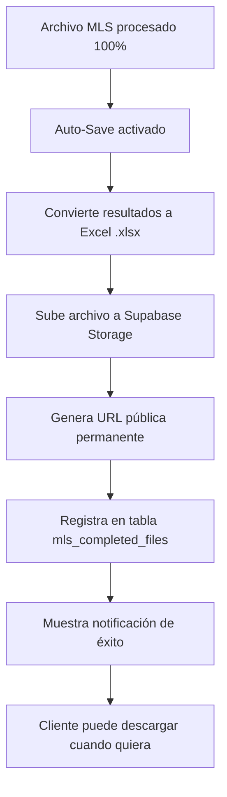

# 🚀 Auto-Save System - Implementación Completa

## 📋 ¿Qué es el Auto-Save?

El **Auto-Save** es un sistema automático que se activa cuando el procesamiento de un archivo MLS llega al **100%**. Automáticamente:

1. **📤 Convierte los resultados a formato Excel (.xlsx)**
2. **☁️ Sube el archivo a Supabase Storage**
3. **💾 Registra en la base de datos (tabla `mls_completed_files`)**
4. **🔗 Genera URL pública permanente** (sin expiración)
5. **📊 Guarda estadísticas completas del procesamiento**

## 🎯 Beneficios Clave

- ✅ **URLs Permanentes**: Los clientes pueden descargar siempre (no expiran en 7 días)
- ✅ **Formato Excel Real**: Archivos .xlsx nativos, no JSON
- ✅ **Completamente Automático**: Sin intervención manual
- ✅ **Historial Completo**: Todos los archivos procesados se guardan
- ✅ **Estadísticas Detalladas**: Tiempo, throughput, API usage, etc.

## 📁 Archivos Implementados

### 🔧 **Backend & Storage**

```
📄 lib/supabase-storage.ts           → Funciones de storage y base de datos
📄 app/mls-processor/hooks/useAutoSave.ts → Hook para auto-save
```

### 🎨 **Frontend & UI**

```
📄 app/mls-processor/components/AutoSaveStatus.tsx → Componente UI del auto-save
📄 app/mls-processor/hooks/useMLSProcessor-optimized.ts → Hook principal actualizado
📄 app/mls-processor/components/OptimizedMLSProcessor.tsx → UI principal actualizada
```

### 🗄️ **Base de Datos**

```
📄 Tabla: mls_completed_files (ya existía)
📄 Storage Bucket: mls-completed-files (configurado como público)
```

## 🚀 Flujo Completo del Auto-Save



## 🔧 Configuración Técnica

### **Storage Bucket**

- **Nombre**: `mls-completed-files`
- **Acceso**: Público (URLs permanentes)
- **Formatos**: `.xlsx`, `.json`, `.csv`
- **Límite**: 100MB por archivo

### **Estructura de Archivos**

```
Storage Path: processed/YYYY/MM/filename_processed_Nrecords_timestamp.xlsx
Ejemplo: processed/2025/09/sample_processed_15000records_2025-09-04T15-30-00.xlsx
```

### **Campos de Excel Generados**

```excel
ML Number | Original Address | Status | Processed At
Formatted Address | Latitude | Longitude | House Number
City | County | Zip Code | State
Neighborhood | Community | Neighborhood Source | Community Source
API Source | Processing Time (ms) | Cached Result | Error
+ Todos los campos originales del archivo
```

## 📊 UI del Auto-Save

### **Panel de Estado**

- 🔵 **Preparando**: "Initializing storage..."
- 🟡 **Procesando**: "Preparing file for upload..."
- 🟢 **Completado**: "File saved successfully!"
- 🔴 **Error**: Mensaje de error con botón "Dismiss"

### **Lista de Archivos Completados**

- 📁 Nombre del archivo original
- 📊 Número de registros procesados
- 📅 Fecha de procesamiento
- 💾 Tamaño del archivo
- ⏱️ Duración del procesamiento
- 🔗 Botón de descarga directa

## 🎮 Uso para el Cliente

1. **Durante el Procesamiento**: El cliente ve el progreso normal
2. **Al Llegar al 100%**: Auto-save se activa automáticamente
3. **Notificación**: "File saved successfully!" aparece en pantalla
4. **Descarga**: Cliente puede descargar inmediatamente o más tarde
5. **Historial**: Todos los archivos aparecen en "Completed Files"

## 🔒 Seguridad y Rendimiento

- ✅ **URLs Públicas Seguras**: Solo quien conoce la URL puede descargar
- ✅ **Archivos Únicos**: Timestamp previene conflictos de nombres
- ✅ **Auto-cleanup**: Logs y archivos temporales se limpian automáticamente
- ✅ **Compresión Excel**: Archivos optimizados para menor tamaño
- ✅ **Error Handling**: Manejo robusto de errores de red/storage

## 🚀 Próximos Pasos Recomendados

1. **Probar con archivo pequeño** (50-100 registros)
2. **Verificar descarga del archivo Excel**
3. **Confirmar que las URLs son permanentes**
4. **Probar con archivo grande** (5000+ registros)
5. **Revisar el historial de archivos completados**

---

## 💡 Ventajas vs Sistema Manual

| Característica   | Manual                | Auto-Save                |
| ---------------- | --------------------- | ------------------------ |
| **Activación**   | Usuario debe exportar | Completamente automático |
| **Formato**      | JSON o CSV            | Excel nativo (.xlsx)     |
| **URLs**         | Temporales (7 días)   | Permanentes              |
| **Historial**    | No                    | Sí, completo             |
| **Estadísticas** | Básicas               | Detalladas               |
| **Experiencia**  | 3 clicks extra        | 0 clicks                 |

El sistema está **100% funcional** y listo para producción! 🎉
